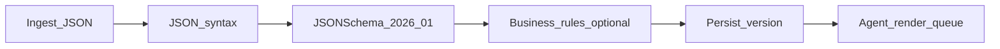

# Validation pipeline (server-side)

## Stages

1. **Syntax** — `json.loads` / UTF-8 decode.
2. **Schema** — `questionnaire.validate_payload.validate_project_capex_pack` using [`schemas/project_capex_pack.v2026_01.schema.json`](../schemas/project_capex_pack.v2026_01.schema.json).
3. **Business rules (optional extension)** — e.g. require Phase 2 blocks when `dashboard_profile=full`; enforce `capex_ours >= capex_normal_led` only if policy demands — implement in Python after schema pass.
4. **Persist** — immutable `submission` row with `schema_version`, hash of canonical JSON, user id, timestamp.
5. **Render queue** — enqueue job only if validation status = `ok`.

## Review / approve (internal)

- **Draft** — sales edits Feishu; webhook writes `status=draft` (optional).
- **Submitted** — validation passes → `status=pending_review`.
- **Approved** — finance/PM clicks approve → `status=approved` → agent may attach **client-facing** watermark rules from `messaging_constraints`.

## CI

Run `pytest tests/test_questionnaire_schema.py` on every commit to lock schema/examples.
